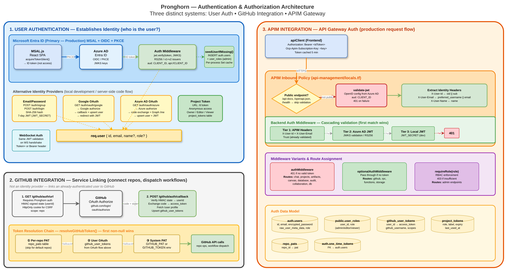

# Authentication & Authorization

> Part of the [Pronghorn Architecture Documentation](../README.md)

Pronghorn implements three distinct but interconnected authentication systems: **User Authentication** (identity), **GitHub Integration** (service linking), and **APIM Integration** (API gateway). Each serves a different purpose and operates at a different layer of the stack.

> 📊 Diagram: [`diagrams/blueprint-authentication-flow.drawio`](./diagrams/blueprint-authentication-flow.drawio)



---

## 1. User Authentication (Identity)

User authentication establishes **who the user is**. The system supports multiple identity providers, with Microsoft Entra ID as the primary production method.

### 1.1 Microsoft Entra ID (Primary — Production)

The primary authentication flow uses MSAL.js with OIDC + PKCE:

1. **Frontend** (`lib/msalConfig.ts`, `lib/msalInstance.ts`): Configures MSAL with `VITE_ENTRA_CLIENT_ID` and `VITE_ENTRA_TENANT_ID`. Fails fast if either is missing.
2. **Token acquisition** (`lib/apiClient.ts`): `acquireTokenSilent()` obtains the **ID token** (not access token) — the ID token has `aud = CLIENT_ID` which is what APIM's `validate-jwt` policy expects. Falls back to popup on `InteractionRequiredAuthError`.
3. **Frontend auth state** (`contexts/AuthContext.tsx`): `MsalProvider` → `AuthProvider` maps MSAL `AccountInfo` to the app's `User` type and manages session state.
4. **Backend validation** (`middleware/auth.ts`): Validates the Azure AD JWT against the JWKS endpoint (`login.microsoftonline.com/{TENANT_ID}/discovery/v2.0/keys`) with RS256, checking both v1 and v2 issuers and dual audiences (`CLIENT_ID`, `api://CLIENT_ID`).
5. **User seeding**: On first valid Azure AD auth, `seedUserIfMissing()` inserts a row into `auth.users` and grants an initial `admin` role in `public.user_roles`. A per-process `Set<string>` cache prevents repeated INSERT attempts.

#### Key Design Decisions

1. **ID Tokens, not Access Tokens.** The application uses the MSAL **ID token** (`aud` = client ID) for API authentication, rather than an access token with custom API scopes. This avoids the need for custom scope consent flows and simplifies the Entra App Registration.

2. **Gateway-Level Validation.** Azure API Management (APIM) acts as the primary token validation layer using a `validate-jwt` policy. After validation, APIM extracts user claims from the token and injects them as HTTP headers (`X-User-Id`, `X-User-Email`, `X-User-Name`) that the backend trusts.

3. **Public Client (No Client Secret).** The SPA uses MSAL with Authorization Code Flow + PKCE. No client secret is required or stored.

### 1.2 Email/Password (Local Development)

A traditional JWT-based auth flow for local development:

- **Signup** (`POST /api/v1/auth/signup`): Creates `auth.users` row with SHA-256 hashed password, returns a 7-day JWT signed with `JWT_SECRET`.
- **Login** (`POST /api/v1/auth/login`): Verifies credentials, returns JWT.
- **Refresh** (`POST /api/v1/auth/refresh`): Re-issues JWT from an existing (possibly expired) token.
- **Logout** (`POST /api/v1/auth/logout`): Client-side only — JWT is stateless.
- **Token generation** (`routes/auth.ts`): `jwt.sign({ sub, email, role, name }, JWT_SECRET, { expiresIn: '7d' })`.

### 1.3 Google OAuth (Local Development)

Standard OAuth 2.0 authorization code flow:

1. `GET /api/v1/auth/oauth/google` → redirects to Google with CSRF state
2. `GET /api/v1/auth/oauth/google/callback` → exchanges code for token → fetches `userinfo` → upserts `auth.users` → generates local JWT → redirects to frontend with token
3. Frontend receives token at `/auth/callback?token=...&redirectTo=...`

### 1.4 Azure AD OAuth (Server-Side Code Flow)

Separate from the MSAL PKCE flow — this is a server-side OAuth 2.0 code exchange:

1. `GET /api/v1/auth/oauth/azure` → redirects to Azure AD authorize endpoint
2. `GET /api/v1/auth/oauth/azure/callback` → exchanges code for tokens → calls MS Graph `/me` for profile → upserts `auth.users` → generates local JWT → redirects to frontend

### 1.5 Project Token RBAC (Anonymous Access)

URL-embedded tokens enable anonymous collaboration without authentication:

```
/project/:projectId/:page/t/:token
```

The `project_tokens` table stores token metadata including role, optional label, expiry, and last-used timestamp.

| Role | Permissions |
|------|-------------|
| **Owner** | Full access — manage tokens, delete project, all CRUD |
| **Editor** | Create, read, update (no token management or deletion) |
| **Viewer** | Read-only access to all project data |

---

## 2. GitHub Integration (Service Linking)

GitHub integration is **not an identity provider** — the platform uses a shared
**GitHub App** (server-to-server) for repository operations and deployment
workflow dispatch. There is no per-user GitHub login.

### 2.1 Installation Token Flow (`routes/github.ts`, `utils/githubAppAuth.ts`)

1. **Token minting** (`getInstallationToken()`): Signs a short-lived App JWT from `GITHUB_APP_ID` + `GITHUB_APP_PRIVATE_KEY`, then exchanges it for an installation access token scoped to `GITHUB_APP_INSTALLATION_ID` (~1 hour TTL, minted on demand). All repo/workflow calls use this token. Resolved centrally by `resolveGitHubToken()` (chain: per-repo PAT → GitHub App → system env).
2. **Status** (`GET /api/v1/github/auth/status`): Returns whether the GitHub App is configured (`connected: isGitHubAppConfigured()`).
3. **Disconnect** (`DELETE /api/v1/github/auth/disconnect`): No-op retained for frontend compatibility.

> The legacy OAuth endpoints (`/auth/url`, `/auth/callback`) have been removed.

> For GitHub App setup instructions, see [GitHub App Setup](../GITHUB_APP_SETUP.md).

### 2.2 Token Resolution (`utils/githubAuth.ts`)

When the backend needs to call GitHub APIs (repo operations, workflow dispatch), it resolves a token using a deterministic fallback chain:

| Priority | Source | Storage | Use Case |
|----------|--------|---------|----------|
| 1 | Per-repo PAT | `repo_pats` table | Specific repository access |
| 2 | GitHub App installation token | `GITHUB_APP_*` env vars (minted on demand) | Default repository + workflow operations |
| 3 | System PAT | `GITHUB_PAT` or `GITHUB_TOKEN` env var | Fallback for system operations |

```typescript
const resolved = await resolveGitHubToken({ repoId });
// resolved.source: 'repo_pat' | 'github_app' | 'system_env'
```

### 2.3 GitHub API Helpers

- `gitHubApiHeaders(token)` — builds standard auth + accept headers
- `gitHubApiFetch(path, token, options)` — authenticated fetch wrapper for `api.github.com`
- `gitHubCloneUrl(org, repo, branch, token)` — builds HTTPS clone URL with optional embedded token

---

## 3. APIM Integration (API Gateway Auth)

Azure API Management sits in front of the Express API in production and handles JWT validation at the gateway layer before requests reach the backend.

### 3.1 APIM Inbound Policy (`infra/modules/api-management/locals.tf`)

The APIM inbound policy performs three steps:

1. **Skip public endpoints**: Requests to `/api-docs`, `/openapi.json`, and `/health` bypass JWT validation.
2. **Validate JWT**: For all other requests, `<validate-jwt>` validates the `Authorization: Bearer` token against the Azure AD OpenID configuration, checking the audience matches the app's client ID.
3. **Extract identity headers**: After validation, APIM extracts claims from the JWT and sets downstream headers:

   | Header | JWT Claim Source | Fallback |
   |--------|-----------------|----------|
   | `X-User-Id` | `oid` | `sub` |
   | `X-User-Email` | `preferred_username` | `email` |
   | `X-User-Name` | `name` | (none) |

### 3.2 Backend Auth Middleware (`middleware/auth.ts`)

The auth middleware uses a **cascading validation strategy** with three tiers:

```
Request arrives
    │
    ├─ APIM headers present? ─── X-User-Id + X-User-Email
    │   └─ YES → Trust headers (APIM already validated JWT)
    │          → Seed auth.users → req.user set → next()
    │
    ├─ Authorization: Bearer header?
    │   ├─ Try Azure AD JWT validation (JWKS, RS256, v1+v2 issuers)
    │   │   └─ SUCCESS → Seed auth.users → req.user set → next()
    │   │
    │   └─ Fallback to local JWT (JWT_SECRET)
    │       └─ SUCCESS → req.user set → next()
    │
    └─ No credentials → 401 Unauthorized (authMiddleware)
                       → Continue anonymously (optionalAuthMiddleware)
```

### 3.3 Middleware Variants

| Middleware | Behavior | Used By |
|------------|----------|---------|
| `authMiddleware` | Returns 401 if no valid token found | chat, projects, artifacts, canvas, database, audit, collaboration, db |
| `optionalAuthMiddleware` | Attaches user if token present, passes through if absent | github, rpc, functions, storage |
| `requireRole(...roles)` | Checks `req.user.role` against allowed roles, returns 403 if insufficient | Admin-only routes |

### 3.4 Frontend Request Assembly (`lib/apiClient.ts`)

The `ApiClient` class assembles outbound requests with both auth mechanisms:

```typescript
// Every API request includes:
headers['Authorization'] = `Bearer ${idToken}`;          // MSAL ID token
headers['Ocp-Apim-Subscription-Key'] = subscriptionKey;  // APIM subscription key

// Token caching: MSAL token cached for 5 minutes to avoid repeated acquireTokenSilent() calls
```

- **Same-origin detection**: `isSameOrigin()` checks whether the API URL matches the frontend origin, enabling `credentials: 'include'` for cookie-based flows.
- **Legacy migration**: Automatically migrates tokens from the old `auth_token` localStorage key to `pronghorn_auth_token`.

---

## 4. WebSocket Authentication

The WebSocket server (`websocket.ts`) performs its own JWT validation during the handshake:

1. Token from query string `?token=` or `Authorization: Bearer` header
2. **Dev mode** (`NODE_ENV=development` or `SKIP_AUTH=true`): Accepts unsigned JWT decode (no signature verification)
3. **Production**: Validates against Azure AD JWKS endpoint (same as REST middleware)
4. Seeds `auth.users` on successful WS-first sign-ins (fire-and-forget)

> **Why WebSocket bypasses APIM:** Azure APIM Consumption tier does not support WebSocket protocol upgrades. WebSocket connections go directly to the Container App, which performs its own JWT validation via the Azure AD JWKS endpoint.

---

## 5. Authorization Model

### 5.1 Application-Level RBAC

Users are assigned roles via the `user_roles` database table.

| Role | Level | Description |
|------|-------|-------------|
| `superadmin` | Highest | Full platform administration |
| `admin` | Middle | Administrative capabilities |
| `user` | Default | Standard user access |

- **Frontend:** The `AdminContext` (`app/frontend/src/contexts/AdminContext.tsx`) queries the `user_roles` table and exposes `isAdmin`, `isSuperAdmin`, and `role`.
- **Backend:** The `requireRole()` middleware (`app/backend/src/middleware/auth.ts`) enforces role requirements on specific routes. Returns 403 if the user's role is insufficient.

### 5.2 Project-Level Permissions

Projects can be shared via tokens stored in the `project_tokens` database table.

| Role | Level | Capabilities |
|------|-------|-------------|
| `owner` | 3 (highest) | Full project control |
| `editor` | 2 | Can modify project content |
| `viewer` | 1 (lowest) | Read-only access |

Token-based access is managed via `app/backend/src/utils/rpcHelpers.ts`. Share tokens are captured from the URL path (`/project/:id/page/t/:token`) by the `useShareToken` hook (`app/frontend/src/hooks/useShareToken.ts`).

### 5.3 Route Protection Matrix

| Route | Middleware | Auth Required? |
|-------|-----------|----------------|
| `/api/v1/health` | None | No |
| `/api/v1/auth` | None | No |
| `/api/v1/chat` | `authMiddleware` | Yes |
| `/api/v1/projects` | `authMiddleware` | Yes |
| `/api/v1/artifacts` | `authMiddleware` | Yes |
| `/api/v1/canvas` | `authMiddleware` | Yes |
| `/api/v1/database` | `authMiddleware` | Yes |
| `/api/v1/deployment` | `authMiddleware` | Yes |
| `/api/v1/audit` | `authMiddleware` | Yes |
| `/api/v1/collaboration` | `authMiddleware` | Yes |
| `/api/v1/db` | `authMiddleware` | Yes |
| `/api/v1/rpc` | `optionalAuthMiddleware` | No (user attached if present) |
| `/api/v1/functions` | `optionalAuthMiddleware` | No |
| `/api/v1/storage` | `optionalAuthMiddleware` | No |
| WebSocket `/ws` | Query-param JWKS | No (anonymous allowed) |

---

## 6. Auth Data Model

| Table | Purpose |
|-------|---------|
| `auth.users` | Canonical user identity (id, email, encrypted_password, metadata) |
| `auth.one_time_tokens` | Password reset / verification tokens (FK → users) |
| `public.user_roles` | RBAC role assignments (user_id, role: admin/editor/viewer) |
| `public.github_user_tokens` | GitHub OAuth tokens (user_id → access_token, github_username, scopes) |
| `public.repo_pats` | Per-repository GitHub PATs |
| `public.project_tokens` | Anonymous project access tokens (role, label, expiry) |

## 7. Frontend Token Storage

| Key | Content | Managed By |
|-----|---------|------------|
| `pronghorn_auth_token` | Local JWT (email/password or OAuth code flow) | `apiClient.ts` |
| `pronghorn_auth_user` | Serialized user object | `apiClient.ts` |
| MSAL cache (localStorage) | Azure AD tokens, accounts, refresh tokens | `@azure/msal-browser` |

---

## 8. Entra ID App Registration

The Entra ID App Registration can be **created and managed by Terraform** (recommended) or **provided manually**. When managed by Terraform, the module enforces security best practices automatically.

> **Deployment Context:** Pronghorn is deployed in an **Azure PBMM Landing Zone** (Canada Central). The Entra ID App Registration can be **created automatically via Terraform** (`create_entra_app_registration = true`) or **provided manually** by supplying `azure_client_id` / `azure_tenant_id` in tfvars.

### 8.1 Required Configuration

#### Platform

- **Application type:** Single-page application (SPA)
- **Do NOT register as:** Web application, native/desktop, or mobile

#### Redirect URIs

| URI | Environment |
|-----|-------------|
| `https://pronghorn.blue` | Production (custom domain) |
| `https://ca-pronghorn-frontend.<env>.canadacentral.azurecontainerapps.io` | Production (Container App FQDN) |
| `http://localhost:5173` | Local development |

#### API Permissions (Delegated)

| Permission | API | Type | Purpose |
|------------|-----|------|---------|
| `openid` | Microsoft Graph | Delegated | OIDC standard — required |
| `profile` | Microsoft Graph | Delegated | User profile claims |
| `email` | Microsoft Graph | Delegated | Email claim |
| `User.Read` | Microsoft Graph | Delegated | Microsoft Graph user profile (requested at login) |

All permissions should have **admin consent granted**.

#### Implicit Grant & Hybrid Flows

| Setting | Value | Reason |
|---------|-------|--------|
| Access tokens | **Unchecked** | MSAL uses Authorization Code Flow + PKCE |
| ID tokens | **Unchecked** | MSAL uses Authorization Code Flow + PKCE |

> **Important:** Do NOT enable implicit grant for SPA applications. MSAL.js v2+ uses the more secure Authorization Code Flow with PKCE.

#### Token Configuration

The following claims must be available in the ID token:

| Claim | Purpose |
|-------|---------|
| `oid` | Azure AD Object ID — used as user identifier |
| `preferred_username` | User's email — used for `X-User-Email` header |
| `name` | Display name — used for `X-User-Name` header |
| `tid` | Tenant ID — used for `X-User-Tenant` header |
| `sub` | Subject — fallback user identifier |

### 8.2 Terraform Automation

The `entra-app-registration` Terraform module (`infra/modules/entra-app-registration/`) can fully manage the app registration as IaC.

```hcl
# params/dev.tfvars
create_entra_app_registration       = true
entra_app_display_name              = "Pronghorn Demo"
entra_app_sign_in_audience          = "AzureADMyOrg"
entra_app_include_localhost_redirect = true
frontend_app_url_override           = "https://pronghorn.blue"
```

**What the Terraform module creates:**

| Resource | Description |
|----------|-------------|
| `azuread_application` | SPA app registration with redirect URIs, API permissions, optional claims |
| `azuread_service_principal` | Enterprise Application for the app registration |
| `azuread_service_principal_delegated_permission_grant` | Admin consent for `openid`, `profile`, `email`, `User.Read` |
| `azuread_application_identifier_uri` | Sets `api://{client-id}` URI and `access_as_user` scope |

**What the module does NOT create (by design):**
- No client secret (SPA uses public client with PKCE)
- No implicit grant (MSAL v2 uses Auth Code + PKCE)

**Improvements over manual setup:**

| Benefit | Description |
|---------|-------------|
| **No client secret** | Eliminates 12-month rotation burden and attack surface |
| **No implicit grant** | Auth Code + PKCE is more secure |
| **Dynamic redirect URIs** | Built from Terraform state, not hardcoded |
| **Admin consent automated** | `azuread_service_principal_delegated_permission_grant` handles consent during `terraform apply` |
| **Drift detection** | `terraform plan` detects out-of-band changes |

**Required permissions for the deploying principal:**

| Permission | Scope | Purpose |
|------------|-------|---------|
| `Application.ReadWrite.All` or `Application Administrator` role | Entra ID | Create and manage app registrations |
| `DelegatedPermissionGrant.ReadWrite.All` | Entra ID | Grant admin consent for delegated permissions |

> **PBMM Note:** If these permissions cannot be granted to the deployment pipeline, set `create_entra_app_registration = false` and provide `azure_client_id` / `azure_tenant_id` from a manually-created app registration.

### 8.3 Auth Variable Resolution

The auth configuration uses a two-mode approach resolved via Terraform locals:

```hcl
effective_client_id = var.create_entra_app_registration
  ? module.entra_app_registration[0].client_id
  : var.azure_client_id

effective_tenant_id = var.create_entra_app_registration
  ? module.entra_app_registration[0].tenant_id
  : var.azure_tenant_id
```

### 8.4 APIM JWT Policy (Terraform-Generated)

The Terraform module dynamically generates the APIM `validate-jwt` policy:

```xml
<validate-jwt header-name="Authorization" failed-validation-httpcode="401" require-scheme="Bearer">
  <openid-config url="https://login.microsoftonline.com/organizations/v2.0/.well-known/openid-configuration" />
  <audiences>
    <audience>${var.azure_client_id}</audience>
    <audience>api://${var.azure_client_id}</audience>
  </audiences>
</validate-jwt>
```

Key points:
- Uses the `organizations` (multi-tenant) OIDC discovery endpoint
- Accepts two audience values: the raw client ID and the `api://` prefixed form
- Auth is conditionally enabled: `enable_entra_auth = var.azure_tenant_id != null && var.azure_client_id != null`

---

## 9. Managed Identities

All major compute resources use **system-assigned managed identities** for service-to-service authentication. No service principal secrets are needed.

| Resource | Role Assignment | Target Resource |
|----------|----------------|-----------------|
| APIM | `Cognitive Services OpenAI User` | Azure AI Foundry |
| API Container App | `AcrPull` | Azure Container Registry |
| API Container App | Key Vault `Get` (secrets) | Azure Key Vault |
| Frontend Container App | `AcrPull` | Azure Container Registry |

The APIM managed identity authenticates to Azure AI Foundry via:

```xml
<authentication-managed-identity resource="https://cognitiveservices.azure.com/" />
```

No API keys are needed for AI model access — APIM's system identity is granted the appropriate role on the AI Foundry resource.

---

## 10. Entra App Registration Audit Checklist

Use this checklist to verify the Entra App Registration is correctly configured, whether created by Terraform or manually.

### Platform & Authentication

- [ ] **Application type** is registered as **Single-page application (SPA)**, not Web or Native
- [ ] **Redirect URIs** include all production + development origins (no wildcards)
- [ ] **Implicit grant** settings: both "Access tokens" and "ID tokens" are **unchecked**
- [ ] **Supported account types** matches the intended scope (single-tenant recommended for PBMM)

### API Permissions

- [ ] Delegated permissions `openid`, `profile`, `email`, `User.Read` are configured
- [ ] **Admin consent** has been granted for all permissions
- [ ] No unnecessary application-level permissions have been granted

### Token Configuration

- [ ] Optional claim `email` is enabled for ID tokens (if not present by default)
- [ ] Token lifetime policies are appropriate (default: 1 hour for ID tokens)

### Security

- [ ] **Client secrets**: SPA public clients should NOT have client secrets
- [ ] **App owners**: Ensure a team email or service account is listed as owner
- [ ] **"User assignment required"** (Enterprise Application): Review whether to restrict access
- [ ] **Remove localhost redirect URIs** from production app registrations

---

## 11. Known Issues & Recommendations

### WebSocket Default Tenant/Client ID Mismatch

**Severity:** Medium — The WebSocket module has different hardcoded fallback values than the auth middleware. Mitigated by environment variables always being set in production via Terraform.

**Recommendation:** Align the hardcoded defaults in `websocket.ts` to match `auth.ts`.

### Multi-Tenant vs. Single-Tenant Inconsistency

**Severity:** Medium — Frontend MSAL and APIM Terraform policy use `organizations` (multi-tenant), while the backend middleware uses a specific tenant ID.

**Recommendation:** Align all components. For PBMM, **single-tenant** is recommended.

### Legacy Auth Routes

**Severity:** Low — `routes/auth.ts` contains email/password, Google OAuth, and Azure AD server-side OAuth endpoints. These are functional but unused by the production frontend (MSAL is the sole production auth).

### Subscription Keys Sent but Not Required

**Severity:** Informational — The frontend sends `Ocp-Apim-Subscription-Key` headers, but APIM has `subscription_required = false`.

---

## Appendix: Environment Variable Reference

### Frontend (Vite)

| Variable | Required | Purpose |
|----------|----------|---------|
| `VITE_AZURE_CLIENT_ID` | Yes (prod) | Entra App Client ID |
| `VITE_AZURE_TENANT_ID` | Yes (prod) | Entra Tenant ID |
| `VITE_AZURE_REDIRECT_URI` | No | OAuth redirect URI |
| `VITE_API_BASE_URL` | Yes | APIM gateway URL |
| `VITE_APIM_SUBSCRIPTION_KEY` | No | APIM subscription key |
| `VITE_WS_URL` | No | WebSocket URL |

### Backend (Express)

| Variable | Required | Purpose | Set By |
|----------|----------|---------|--------|
| `AZURE_TENANT_ID` | Yes (prod) | Tenant for JWKS endpoint | Terraform |
| `AZURE_CLIENT_ID` | Yes (prod) | Audience for JWT validation | Terraform |
| `JWT_SECRET` | No | Dev JWT signing key | Key Vault (conditional) |
| `NODE_ENV` | No | Environment mode | Terraform |

### Terraform

| Variable | Required | Purpose |
|----------|----------|---------|
| `create_entra_app_registration` | No | `true` to create app via Terraform (default: `false`) |
| `azure_tenant_id` | When manual | Entra Tenant ID |
| `azure_client_id` | When manual | Entra App Client ID |
| `entra_app_display_name` | No | Display name (default: `"Pronghorn"`) |
| `frontend_app_url_override` | When automated | Primary redirect URI |

## Appendix: Key File Reference

| File | Purpose |
|------|---------|
| `app/frontend/src/lib/msalConfig.ts` | MSAL configuration — client ID, authority, scopes, cache |
| `app/frontend/src/lib/msalInstance.ts` | MSAL `PublicClientApplication` singleton |
| `app/frontend/src/contexts/AuthContext.tsx` | React auth context — login, logout, token acquisition |
| `app/frontend/src/lib/apiClient.ts` | HTTP client — Bearer token and subscription key injection |
| `app/frontend/src/lib/signalRClient.ts` | WebSocket client — MSAL token as query param |
| `app/frontend/src/contexts/AdminContext.tsx` | RBAC context — queries `user_roles` table |
| `app/frontend/src/hooks/useShareToken.ts` | Project share token extraction and caching |
| `app/backend/src/middleware/auth.ts` | Backend auth middleware — 3-tier validation |
| `app/backend/src/routes/auth.ts` | Legacy auth routes (email/password, OAuth) |
| `app/backend/src/websocket.ts` | WebSocket server — JWKS JWT validation |
| `app/backend/src/utils/rpcHelpers.ts` | Project-level authorization — token-based RBAC |
| `infra/modules/api-management/locals.tf` | Dynamic APIM JWT policy generation |
| `infra/modules/entra-app-registration/main.tf` | Entra App Registration Terraform module |
