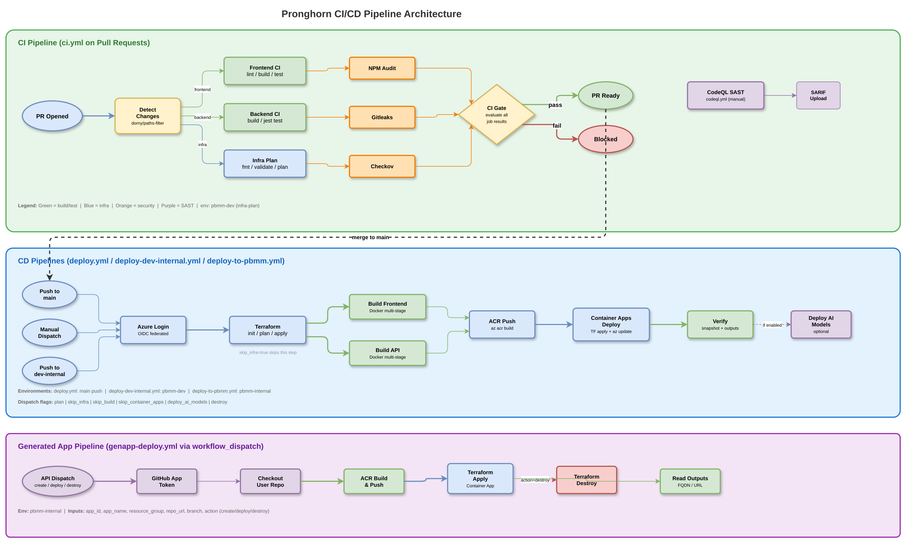

# CI/CD & Deployment

> Part of the [Pronghorn Architecture Documentation](../README.md)

---

## Which Deployment Path Do I Use?

Pronghorn supports two deployment paths. Choose based on your target environment:

| | **Online** | **PBMM** |
| --- | --- | --- |
| **Use when** | Dev, test, demo environments | Government of Canada PBMM landing zones |
| **Guide** | [Online Deployment Guide](../ONLINE_DEPLOYMENT.md) | [PBMM Deployment Guide](../PBMM_DEPLOYMENT.md) |
| **Workflow** | `deploy-dev-internal.yml` | `deploy-to-pbmm.yml` |
| **Terraform archetype** | `online` (public endpoints) | `corp` (VNet injection + private endpoints) |
| **tfvars file** | `params/dev.tfvars` | `params/pbmm.tfvars` |
| **Runner** | GitHub-hosted `ubuntu-latest` | Self-hosted `[self-hosted, linux, pbmm]` inside the VNet |
| **Trigger** | Push to `dev-internal` branch + `workflow_dispatch` | Push to `pbmm-internal` branch + `workflow_dispatch` |
| **GitHub Environment** | `pbmm-dev` | `pbmm-internal` |
| **Network model** | Public access, firewall rules | Private endpoints only, never opened |
| **Storage / Key Vault** | Public access temporarily opened per run | Always private |
| **`SecurityControl=Ignore` tag** | Applied to tfstate storage account | Skipped (`-SkipSecurityControlTag`) |
| **Image build** | `docker build` + `docker push` on runner | `az acr build` on private ACR agent pool |
| **APIM SKU** | Consumption (no VNet) | Premium (Internal VNet mode) |
| **PostgreSQL SKU** | Burstable (cost-optimized) | General Purpose (production) |
| **HA / geo-redundancy** | Off | On (multi-AZ, GRS, 35-day backups) |

---

## Shared Concepts

Both deployment paths use the same underlying patterns. These are explained once
here and referenced from both path-specific guides.

### OIDC Authentication (GitHub → Azure)

Both workflows authenticate with `azure/login@v2` using OIDC federated
credentials — no client secrets. The flow:

1. Create an Entra app registration for the CI/CD identity.
2. Add a federated credential with `subject` matching
   `repo:<org>/pronghorn:environment:<env-name>` (where `<env-name>` is
   `pbmm-dev` or `pbmm-internal`).
3. Assign RBAC: **Contributor** + **User Access Administrator** on the target
   scope, plus **Storage Blob Data Contributor** on the tfstate storage account.

The OIDC subject must exactly match the GitHub Environment name in the workflow.
A mismatch produces `AADSTS700213`.

### Terraform State Backend

Both paths use an Azure Storage Account to store Terraform state, bootstrapped
by `infra/scripts/bootstrap-tfstate.ps1`. The script is idempotent and
creates the RG, storage account, and blob container if missing. Key differences:

- **Online:** Public access enabled, `SecurityControl=Ignore` tag applied.
- **PBMM:** Private endpoint created, public access disabled
  (`-SkipSecurityControlTag`). State operations must run from inside the VNet.

State is accessed via `use_azuread_auth=true` (no storage keys).

### Container Apps Deployment Model

Both paths deploy to Azure Container Apps:

1. Terraform provisions the Container Apps Environment (CAE), Container Apps,
   and supporting infrastructure.
2. Container images are built and pushed to Azure Container Registry (ACR).
3. Container Apps are updated to the new image revision.

The CAE generates a random domain segment (e.g. `<env-suffix>`) that
appears in all Container App FQDNs. This segment changes if the environment is
recreated.

### GitHub Environment Secrets & Variables

Both workflows read credentials from a GitHub Environment (encrypted secrets
for sensitive values, plaintext variables for identifiers). The environment name
must match the OIDC federated credential subject and the workflow's
`environment: name:` setting.

Common secrets: `AZURE_CLIENT_ID`, `AZURE_TENANT_ID`, `AZURE_SUBSCRIPTION_ID`,
`POSTGRES_ADMIN_PASSWORD`, `POSTGRES_GENAPPS_ADMIN_PASSWORD`, `JWT_SECRET`.

PBMM adds: `APP_PRIVATE_KEY` (for GitHub App integration with private
networking).

### Entra ID App Registration (End-User Sign-In)

The frontend uses MSAL for Azure AD sign-in. The app registration can be
Terraform-managed (`create_entra_app_registration = true`) or manually created.
In both cases, the SPA redirect URI must match the deployed frontend URL.

### GitHub App

Pronghorn uses a **GitHub App** for server-side repository operations and
workflow dispatch (it is **not** an identity provider — there is no per-user
GitHub sign-in):

| Identity | Purpose | Required for |
| --- | --- | --- |
| **GitHub App** | Backend repository operations and dispatches the GenApp deploy workflow | Generated-app deployment |

It is optional in Online (if not deploying generated apps) but required in PBMM
production deployments. See
[PBMM Guide §5.5](../PBMM_DEPLOYMENT.md#55-github-app) for setup details.

---

## Workflow Inventory

| Workflow | Trigger | Purpose | Guide |
|----------|---------|---------|-------|
| `ci.yml` | Pull requests | Path-filtered lint/build/test for frontend, backend, infra; Terraform plan | — |
| `deploy-dev-internal.yml` | Push to `dev-internal` / manual | Online deployment with optional stage gates | [Online Guide](../ONLINE_DEPLOYMENT.md) |
| `deploy-to-pbmm.yml` | Push to `pbmm-internal` / manual | PBMM deployment via self-hosted runner (private endpoints) | [PBMM Guide](../PBMM_DEPLOYMENT.md) |
| `genapp-deploy.yml` | Workflow dispatch | Generated app deploy/create/destroy lifecycle | — |
| `deploy.yml` | Main branch push / manual | ⚠️ **Legacy** — scheduled for removal. Simple Container Apps deploy without Terraform. | — |

## Pipeline Flow

> 📊 Diagram: [`diagrams/blueprint-cicd-pipeline.drawio`](./diagrams/blueprint-cicd-pipeline.drawio)

## Deployment Scripts

Key scripts in `infra/scripts/`:

| Script | Purpose |
|--------|---------|
| `deploy.ps1` | Core infra + container build/push + deploy orchestration |
| `deploy-containers.ps1` | Build/push/update frontend and API containers |
| `bootstrap-tfstate.ps1` | Create Terraform state backend (RG, storage, container) |
| `New-PbmmRunner.ps1` | Provision private self-hosted GitHub runner VM (PBMM only) |
| `New-PbmmSubnets.ps1` | Create workload subnets in the PBMM VNet (PBMM only) |
| `sync-genapp-vars.sh` | Sync Terraform outputs to GitHub environment variables |
| `run_migration.js` | Apply SQL migration files to PostgreSQL |

## Operational Runbooks

| Runbook | Scope | Purpose |
|---------|-------|---------|
| [Custom Domain Setup](../operations/custom-domain-setup.md) | PBMM | App Gateway topology, DNS plumbing, backend pool repointing |
| [PBMM Troubleshooting](../operations/pbmm-troubleshooting.md) | PBMM | Private DNS zone linking, APIM drift, infrastructure gaps |
| [Deployment Rollback](../deployment-rollback.md) | Both | Rollback procedure using deployment snapshot artifacts |
