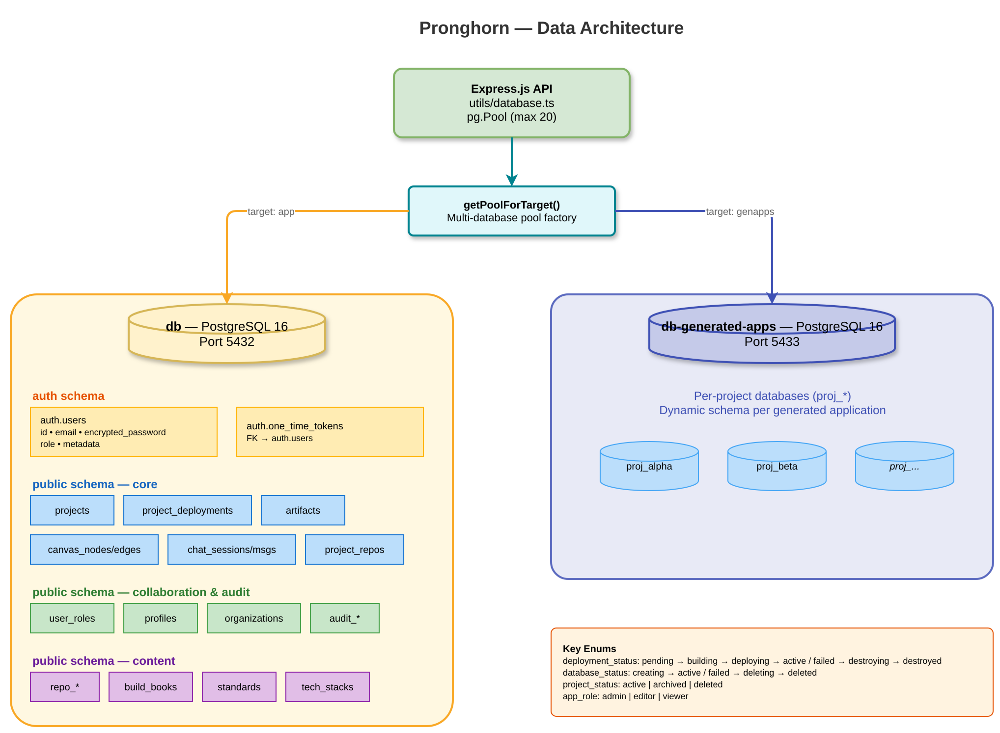

# Data Architecture

> Part of the [Pronghorn Architecture Documentation](../README.md)

---

## Database Topology

> 📊 Diagram: [`diagrams/blueprint-database-topology.drawio`](./diagrams/blueprint-database-topology.drawio)



## Schema Overview

**Auth schema:**

| Table | Purpose |
|-------|---------|
| `auth.users` | User accounts (email, encrypted password, role, metadata) |
| `auth.one_time_tokens` | Recovery/verification tokens (FK → users) |

**Public schema — core entities:**

| Table | Purpose |
|-------|---------|
| `projects` | Project metadata, status, ownership |
| `project_deployments` | Deployment state, Key Vault refs, env config |
| `project_databases` | Per-project database connections |
| `project_repos` | Git repository associations |
| `artifacts` | Project artifacts (docs, specs, diagrams) |
| `canvas_nodes` / `canvas_edges` | Visual canvas graph data |
| `chat_sessions` / `chat_messages` | AI conversation history |

**Public schema — collaboration & audit:**

| Table | Purpose |
|-------|---------|
| `user_roles` | RBAC role assignments |
| `profiles` | User profile data |
| `organizations` | Multi-tenant org structure |
| `github_user_tokens` | GitHub OAuth tokens |
| `collaboration sessions` | Real-time collaboration state |
| `audit_*` | Audit trail tables |
| `agent_*` | AI agent execution records |

**Public schema — content & configuration:**

| Table | Purpose |
|-------|---------|
| `repo_*` | Repository file storage and staging |
| `build_books` | Build book templates |
| `standards` | Coding standards definitions |
| `tech_stacks` | Technology stack configurations |
| `requirements` | Project requirements |

## Key Enums

```sql
deployment_status: pending | building | deploying | active | failed | destroying | destroyed
database_status:   creating | active | failed | deleting | deleted
project_status:    active | archived | deleted
app_role:          admin | editor | viewer
```

## Migration Strategy

- Migrations live in `infra/migrations/` as numbered SQL files
- Applied via `migrate.ts` on startup (if `RUN_MIGRATIONS_ON_STARTUP=true`) or via `/api/migrate` endpoint
- Schema `001_full_schema.sql` is the baseline (all tables, enums, indexes)
- Subsequent migrations (`009`–`011`) handle Key Vault column additions and plaintext secret removal
- Docker Compose auto-runs migrations by mounting `infra/migrations/` into PostgreSQL's `docker-entrypoint-initdb.d/`

## Data Access Patterns

| Pattern | Usage |
|---------|-------|
| **Direct SQL** | All queries use parameterized `$1, $2` placeholders via `pg` |
| **Connection pooling** | `pg.Pool` with max 20 connections, 10s timeout |
| **Transactions** | `transaction()` helper wraps `BEGIN`/`COMMIT`/`ROLLBACK` |
| **Multi-target pools** | `getPoolForTarget()` routes to app DB or genapp DB |
| **Auto-recovery** | Pool resets on connection/target errors |
| **No ORM** | Intentional choice — raw SQL for full control and performance |
