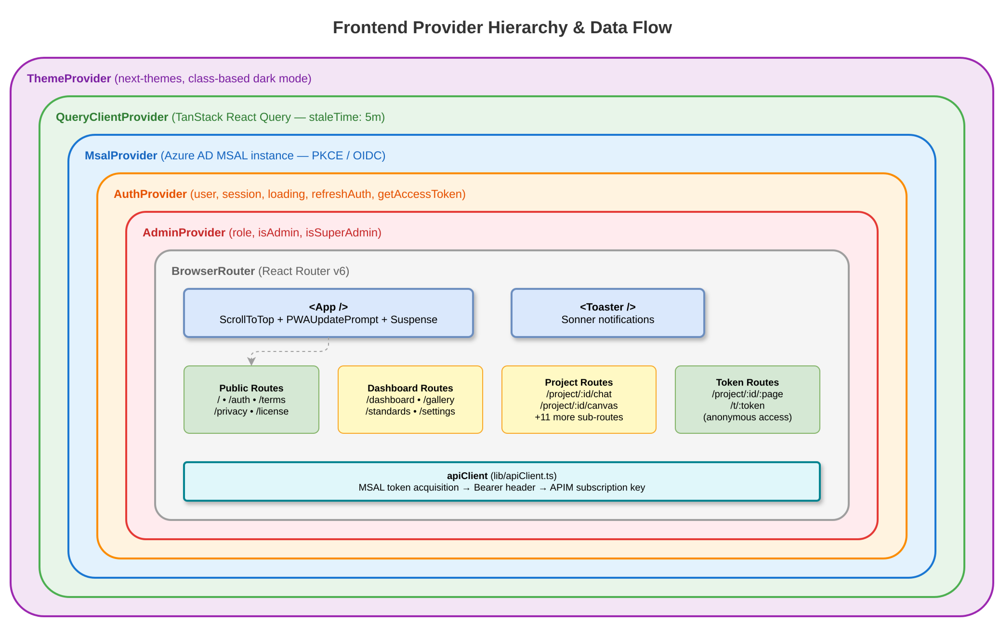

# Frontend Architecture

> Part of the [Pronghorn Architecture Documentation](../README.md)

---

## Technology Stack

| Technology | Version | Purpose |
|------------|---------|---------|
| React | 18.3 | UI framework |
| TypeScript | 5.8 | Type safety |
| Vite | 7.3 | Build tooling, dev server, HMR |
| Tailwind CSS | 3.4 | Utility-first styling |
| shadcn/ui | (Radix-based) | Component library primitives |
| React Query | 5.83 (TanStack) | Server state management |
| React Router | 6.30 | Client-side routing |
| MSAL React | 2.2 | Azure AD authentication |
| Monaco Editor | 4.7 | Code editing |
| ReactFlow | 11.11 | Visual canvas |
| Recharts | 2.15 | Data visualization |

## Application Bootstrap

The app mounts through a nested provider hierarchy:

> 📊 Diagram: [`diagrams/blueprint-frontend-providers.drawio`](./diagrams/blueprint-frontend-providers.drawio)



**React Query configuration** (`lib/react-query.ts`):
- `staleTime`: 5 minutes
- Window-focus refetch disabled
- Default retry behavior

## Routing Architecture

Routes are defined in `App.tsx` with Suspense-based lazy loading:

| Category | Routes | Auth |
|----------|--------|------|
| **Public** | `/`, `/auth`, `/auth/callback`, `/terms`, `/privacy`, `/license` | None |
| **Dashboard** | `/dashboard`, `/gallery`, `/standards`, `/tech-stacks` | Implicit (via `useAuth()`) |
| **Build Books** | `/build-books`, `/build-books/new`, `/build-books/:id` | Implicit |
| **Settings** | `/settings/organization`, `/settings/profile` | Implicit |
| **Project** | `/project/:projectId/{page}` | Implicit |
| **Token Access** | `/project/:projectId/{page}/t/:token` | Token-based (anonymous) |

**Project sub-routes:** `settings`, `artifacts`, `chat`, `requirements`, `standards`, `canvas`, `audit`, `build`, `repository`, `specifications`, `database`, `deploy`, `present`

> **Note:** Route guards are implicit — pages use `useAuth()` / `useAdmin()` hooks internally rather than a top-level `ProtectedRoute` wrapper. A `RequireSignupValidation` component exists but is not wired into the router.

## Component Architecture

Components follow **feature-based organization** with a shared primitives layer:

```
components/
├── ui/              # ← Shared primitives (shadcn/ui + Radix)
│   ├── button.tsx       dialog.tsx       sheet.tsx
│   ├── form.tsx         sidebar.tsx      toast.tsx
│   └── ... (40+ primitives)
│
├── auth/            # Authentication components
├── dashboard/       # Dashboard views
├── project/         # Project management
├── canvas/          # Visual canvas editor
├── build/           # Build pipeline views
├── deploy/          # Deployment management
├── artifacts/       # Artifact management
├── audit/           # Audit trail
├── collaboration/   # Real-time collaboration
├── requirements/    # Requirements management
├── standards/       # Coding standards
├── techstack/       # Tech stack selection
├── buildbook/       # Build book templates
├── gallery/         # Project gallery
├── resources/       # Resource management
└── layout/          # Shell layout components
```

## State Management

| Layer | Mechanism | Scope |
|-------|-----------|-------|
| **Server state** | React Query (`@tanstack/react-query`) | API data caching, refetching |
| **Auth state** | `AuthContext` | User identity, tokens, session |
| **Admin state** | `AdminContext` | Role, `isAdmin`, `isSuperAdmin` |
| **UI state** | Component-local `useState` / `useReducer` | Form state, toggles, modals |
| **Theme** | `ThemeProvider` (next-themes) | Dark/light mode preference |

## Data Fetching

The frontend uses a centralized **API client** (`lib/apiClient.ts`) that:

1. Acquires MSAL Bearer tokens via `acquireTokenSilent` / popup fallback
2. Attaches APIM subscription key header (`ocp-apim-subscription-key`)
3. Provides typed `get`, `post`, `put`, `patch`, `delete` methods
4. Implements brief token caching to avoid redundant acquisition
5. Routes all requests through a configurable `VITE_API_BASE_URL`

```typescript
// Usage pattern:
const data = await apiClient.get<Project[]>('/projects');
const result = await apiClient.post('/projects', { name: 'New Project' });
```

> **Mixed patterns:** Some older hooks use direct `fetch()` calls. New code should use `apiClient` exclusively.

## Theming & Design System

- **Approach:** CSS custom properties (HSL) + Tailwind utility classes
- **Dark mode:** Class-based via `next-themes` ThemeProvider
- **Token structure** (`index.css`): `--background`, `--foreground`, `--primary`, `--secondary`, `--accent`, `--destructive`, `--muted`, sidebar-specific tokens
- **Public pages:** Separate theme (`styles/public.css`) for marketing pages
- **Constraint:** Layout modifications are prohibited without client approval; only styling within existing structure is permitted

## Key Environment Variables

| Variable | Purpose |
|----------|---------|
| `VITE_ENTRA_CLIENT_ID` | Azure AD app registration client ID |
| `VITE_ENTRA_TENANT_ID` | Azure AD tenant ID |
| `VITE_AZURE_REDIRECT_URI` | MSAL redirect URI |
| `VITE_API_BASE_URL` | Backend API base URL |
| `VITE_APIM_SUBSCRIPTION_KEY` | Azure APIM subscription key |
| `VITE_USE_AZURE_API` | Toggle Azure API mode |
| `VITE_AUTH_MODE` | Authentication mode selector |
