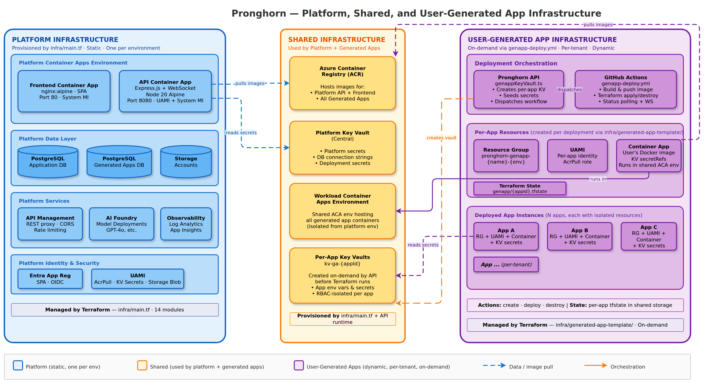

# Infrastructure & Deployment

> Part of the [Pronghorn Architecture Documentation](../README.md)

---

## Three-Tier Infrastructure Model

Pronghorn separates infrastructure into three distinct tiers: **Platform**, **Shared**, and **User-Generated App**. Each tier has different provisioning mechanisms, lifecycles, and ownership boundaries.

> 📊 Diagram: [`diagrams/blueprint-platform-genapp-separation.drawio`](./diagrams/blueprint-platform-genapp-separation.drawio)



---

## Tier 1: Platform Infrastructure

**Static, one per environment.** Provisioned by `infra/main.tf` via Terraform. These resources run the Pronghorn application itself.

### Platform Terraform Module Inventory

| Module | Resources Created | Key Dependencies |
|--------|-------------------|------------------|
| `logging` | Log Analytics Workspace, Application Insights | RG, location |
| `container-apps` | Platform ACA environment, API Container App, UAMI, ingress | Logging, ACR, subnet, secrets |
| `frontend` | Frontend Container App (existing ACA env), identity | ACA env ID, ACR, env vars |
| `postgresql` | PostgreSQL Flexible Server, DB, firewall, HA | Subnet/VNet, admin creds |
| `api-management` | APIM, APIs, policies, logger, optional OpenAI proxy | App Insights, backend URL, Entra IDs |
| `entra-app-registration` | App registration, SPA redirects, service principal | AzureAD provider, owners |
| `ai-foundry` | AI Services account, project, model deployments | Subscription, RG, model list |
| `frontdoor` | Front Door profile, endpoint, origin, WAF | App Gateway FQDN, custom domains |
| `agw` | Application Gateway, SSL certs, backend pools | Subnet, Key Vault cert IDs |

### Platform Container Strategy

| Component | Base Image | Build | Serving |
|-----------|-----------|-------|---------|
| **API** | `node:20-alpine` | Multi-stage: install deps → build TS → copy `dist/` + migrations | `node dist/index.js` |
| **Frontend** | `nginx:alpine` | Prebuild externally, copy `dist/` + `nginx.conf` | nginx static serving |

Both containers include health checks:
- API: `curl -f http://localhost:8080/health`
- Frontend: `curl -f http://localhost:80/health`

### Platform RBAC & Identity

- **User-Assigned Managed Identity (UAMI):** Created for API container app; granted AcrPull, Storage Blob Data Contributor, Key Vault Secrets User, Contributor on workload subscription
- **System-Assigned Identity:** Enabled on both API and frontend container apps
- **Entra App Registration:** SPA redirect URIs, Graph `User.Read` delegated permission, optional exposed API scope

---

## Tier 2: Shared Infrastructure

**Long-lived, used by both platform and generated apps.** Provisioned by `infra/main.tf` (Terraform) and the Pronghorn API runtime. These resources bridge the platform and user-generated app tiers.

| Resource | Provisioned By | Consumers |
|----------|---------------|-----------|
| **Azure Container Registry (ACR)** | `infra/main.tf` (`container-registry` module) | Platform containers + all generated app containers |
| **Platform Key Vault** | `infra/main.tf` (`keyvault` module) | Platform secrets, DB connection strings |
| **Workload ACA Environment** | `infra/main.tf` (`workload-environment` module) | All generated app container apps |
| **Storage Accounts** | `infra/main.tf` (`storage` module) | Platform artifacts, repo content |
| **Per-App Key Vaults** | Pronghorn API runtime (`genappKeyVault.ts`) | Individual generated apps (RBAC-isolated) |

### Shared Terraform Modules

| Module | Resources Created | Key Dependencies |
|--------|-------------------|------------------|
| `container-registry` | ACR, optional geo-replication, optional PE | RG, subnet, DNS zone |
| `keyvault` | Key Vault, RBAC assignments, secrets | Secrets map, PE subnet, principal IDs |
| `storage` | Storage Account, containers, CORS, optional PE | PE subnet, containers map |
| `workload-environment` | ACA managed environment for generated apps, optional PE | Subnet, DNS zone |

---

## Tier 3: User-Generated App Infrastructure

**Dynamic, per-tenant, on-demand.** Provisioned through a coordinated pipeline: the Pronghorn API seeds secrets and dispatches a GitHub Actions workflow (`genapp-deploy.yml`), which runs Terraform from `infra/generated-app-template/`.

### Per-App Resources Created

| Resource | Purpose |
|----------|---------|
| **Resource Group** | Isolation boundary (`pronghorn-genapp-{name}-{env}`) |
| **User-Assigned Managed Identity** | Per-app identity with AcrPull role for image access |
| **Container App** | Runs in the shared workload ACA environment, wired with KV secretRefs |
| **Terraform State** | `genapp/{app_id}.tfstate` in shared state storage |

### Deployment Pipeline (High-Level)

```
User triggers deploy → API seeds Key Vault → API dispatches workflow
    → GitHub Actions builds image → Terraform provisions resources
    → Backend polls status → WebSocket updates to UI
```

### Deployment Actions

| Action | What Happens |
|--------|-------------|
| **create** | Full provisioning: KV + image build + Terraform apply → new resource group, identity, container app |
| **deploy** | Redeployment: update secrets + rebuild image + Terraform apply → new container revision |
| **destroy** | Teardown: Terraform destroy + state cleanup + KV purge |

> For the detailed deployment lifecycle, Key Vault bootstrap model, environment differences, and troubleshooting, see [**User-Generated Application Deployment**](genapp-deployment.md).

---

## Environment Archetypes

| Archetype | tfvars File | Characteristics |
|-----------|-------------|-----------------|
| **dev** | `params/dev.tfvars` | Online/public endpoints, relaxed networking |
| **pbmm** | `params/pbmm.tfvars` | PBMM corporate landing zone, private endpoints, self-hosted runners |

> For PBMM-specific deployment procedures, see [PBMM Deployment Guide](../PBMM_DEPLOYMENT.md).

---

## Local Development

```bash
# Full stack (from repo root)
npm install               # Install concurrently
npm run dev               # Starts: docker-compose (DBs) + API (nodemon) + Frontend (Vite)
npm run dev:stop          # Stop database containers
npm run dev:reset         # Wipe DB volumes and recreate

# Individual layers
cd app/backend  && npm run dev     # ts-node + nodemon, port 8080
cd app/frontend && npm run dev     # Vite dev server, port 8080
```

Docker Compose runs **databases only** — API and frontend run natively via npm for fast iteration.

> For the full local development walkthrough, see [Local Development Guide](../LOCAL_DEVELOPMENT.md).

---

## Azure Deployment

### Platform Deployment

Follows: **Infra provision → Container build/push → App update**

1. `terraform apply` with environment tfvars
2. Docker build + push to ACR (API + Frontend images)
3. Container App revision update pointing to new image tags
4. APIM configuration update (if needed)

### Generated App Deployment

Follows: **KV seed → Image build → Workflow dispatch → Status polling**

1. Seed Azure Key Vault with app secrets (`genappKeyVault.ts`)
2. Dispatch GitHub Actions workflow (`genapp-deploy.yml`)
3. Build and push app image to shared ACR
4. Terraform apply with `infra/generated-app-template/`
5. Backend poller monitors workflow status and broadcasts WebSocket updates

> For the complete on-demand deployment flow, see [**User-Generated Application Deployment**](genapp-deployment.md).

---

## Deployment Troubleshooting

### Platform Issues

| Issue | Resolution |
|-------|------------|
| ARM cross-compilation (Apple Silicon) | Use `docker buildx` with `--platform linux/amd64` or `az acr build` |
| APIM Consumption activation delays | Wait 1–5 minutes and re-run `terraform apply` |
| APIM Internal VNet `NetworkSecurityGroupNotFound` | Attach NSG with required rules to APIM subnet before deployment |
| APIM stuck in `Activating` (ExpressRoute) | Add UDR with Internet next-hop overrides for APIM service tags |
| APIM `ServiceLocked` | Open Microsoft support ticket; auto-expires in ~6 hours |
| AI model deployment race conditions | Re-run `terraform apply` to retry failed deployments |
| `ResourceGroupNotFound` on first deploy | Wait 30–60 seconds for propagation, re-run |

### Generated App Issues

| Issue | Resolution |
|-------|------------|
| Key Vault creation blocked by Azure Policy | Ensure `SecurityControl=Ignore` tag in dev (`AZURE_GENAPP_KEYVAULT_PUBLIC_NETWORK_ACCESS=Enabled`) |
| DNS propagation timeout (PBMM) | Increase `AZURE_GENAPP_KEYVAULT_DNS_WAIT_TIMEOUT_SECONDS`; verify private DNS zone linked to VNet |
| 404 on user repo checkout | Verify GitHub App installed on user's org with repo access |
| ACR/ACA env not found by workflow | Verify `PLATFORM_RESOURCE_GROUP` env var in GitHub Environment |

> For comprehensive generated app troubleshooting, see [User-Generated Application Deployment](genapp-deployment.md#troubleshooting).

> For rollback procedures, see [Deployment Rollback](../deployment-rollback.md).
