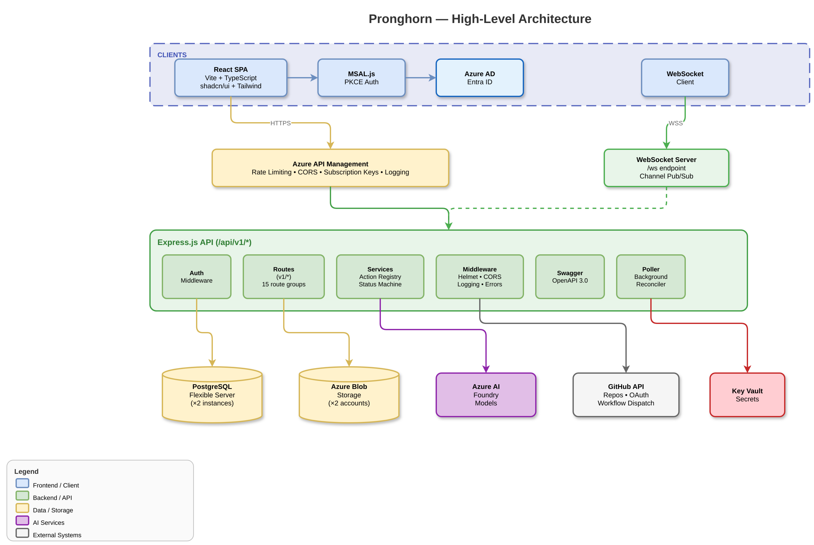

# Architectural Overview

> Part of the [Pronghorn Architecture Documentation](../README.md)

---

## 1. Architectural Overview

Pronghorn is an **AI-assisted software platform** that enables users to create, manage, and deploy software projects through an intelligent web interface. The system combines project management, code generation, AI chat, real-time collaboration, and deployment orchestration into a single platform.

### High-Level Architecture

> 📊 Diagram: [`diagrams/blueprint-high-level-architecture.drawio`](./diagrams/blueprint-high-level-architecture.drawio)



### Architectural Style

The system follows a **layered monorepo** architecture:

- **Presentation Layer:** React SPA with feature-based component organization
- **API Gateway Layer:** Azure API Management (optional, transparent in local dev)
- **Application Layer:** Express.js with versioned REST routes and WebSocket
- **Domain/Service Layer:** Feature-oriented services with action registry pattern
- **Data Layer:** PostgreSQL via `pg` driver with direct SQL (no ORM)
- **Infrastructure Layer:** Terraform modules for Azure resource provisioning

Communication is **direct Web App → API** — the frontend calls API endpoints directly via a centralized `apiClient` fetch wrapper.

---

## 2. Guiding Principles

| Principle | Implementation |
|-----------|----------------|
| **Layer separation** | Frontend, backend, and infra are isolated npm/Terraform workspaces with independent build/test/deploy |
| **API versioning** | All routes under `/api/v1/*`; OpenAPI spec auto-generated from route JSDoc |
| **Feature-based organization** | Frontend components grouped by domain feature, not by type |
| **Convention over configuration** | Consistent patterns for routes, middleware, services, and tests |
| **Infrastructure as Code** | All Azure resources managed via Terraform modules with environment-specific tfvars |
| **Security by default** | Helmet, CORS, JWT validation, RBAC, Key Vault secrets — never plaintext credentials |
| **UI/UX layout immutability** | Frontend layout changes require explicit client approval; styling-only changes permitted |

---

## 3. System Context

### External System Integrations

| System | Purpose | Integration Point |
|--------|---------|-------------------|
| **Microsoft Entra ID** | Primary identity provider (OIDC/PKCE) | MSAL.js in frontend, JWT validation in backend |
| **Azure AI Foundry** | AI model hosting (chat, summarization) | API proxy via APIM + direct backend calls |
| **GitHub API** | Repository management, OAuth, workflow dispatch | Backend service + OAuth flow |
| **Azure Blob Storage** | File/artifact/staged content storage | Backend via `@azure/storage-blob` SDK |
| **Azure Key Vault** | Secret management for deployments | Backend via Azure Identity SDK |
| **Azure API Management** | API gateway, rate limiting, subscription keys | Transparent proxy in front of backend |

### User Roles

| Role | Access Level |
|------|-------------|
| **Super Admin** | Full platform control, user management |
| **Admin** | Organization management, all project operations |
| **Editor** | Create/edit projects, artifacts, collaboration |
| **Viewer** | Read-only access to shared projects |
| **Anonymous** | Token-based project access (no login required) |

---

## 4. Repository Layout

```
pronghorn-organization/
├── app/
│   ├── backend/                 # Express.js API service
│   │   ├── src/
│   │   │   ├── index.ts         # Entry point, middleware stack, server boot
│   │   │   ├── routes/          # Versioned API routes (/api/v1/*)
│   │   │   │   └── v1/          # All v1 route handlers
│   │   │   ├── services/        # Domain services (action registry pattern)
│   │   │   │   └── deployment/  # Docker deployment service module
│   │   │   ├── middleware/      # Auth, error handling
│   │   │   ├── config/          # AI model configuration
│   │   │   ├── types/           # TypeScript type extensions
│   │   │   ├── utils/           # Database, logging, helpers
│   │   │   ├── swagger.ts       # OpenAPI 3.0.3 spec generation
│   │   │   ├── websocket.ts     # WebSocket server (channel pub/sub)
│   │   │   ├── migrate.ts       # SQL migration runner
│   │   │   └── __tests__/       # Jest test suite
│   │   ├── Dockerfile           # Multi-stage Node 20 Alpine
│   │   ├── package.json
│   │   └── tsconfig.json
│   │
│   └── frontend/                # React SPA
│       ├── src/
│       │   ├── main.tsx         # App bootstrap with providers
│       │   ├── App.tsx          # Router + route definitions
│       │   ├── components/      # Feature-organized components
│       │   │   ├── ui/          # shadcn/ui primitives (Radix-based)
│       │   │   ├── auth/        # Auth components
│       │   │   ├── dashboard/   # Dashboard views
│       │   │   ├── project/     # Project management
│       │   │   ├── canvas/      # Visual canvas
│       │   │   ├── build/       # Build views
│       │   │   ├── deploy/      # Deployment views
│       │   │   ├── layout/      # Layout shell components
│       │   │   └── ...          # 15+ feature directories
│       │   ├── pages/           # Route page components
│       │   ├── contexts/        # React contexts (Auth, Admin)
│       │   ├── hooks/           # Custom React hooks
│       │   ├── lib/             # API client, MSAL, utilities
│       │   ├── utils/           # Parsing, generation helpers
│       │   ├── config/          # App configuration
│       │   ├── integrations/    # External service adapters
│       │   └── styles/          # Additional CSS
│       ├── Dockerfile           # nginx:alpine static server
│       ├── nginx.conf
│       ├── package.json
│       └── vite.config.ts
│
├── infra/                       # Terraform IaC
│   ├── main.tf                  # Root module orchestration
│   ├── variables.tf             # 184 input variables
│   ├── outputs.tf               # Resource outputs
│   ├── modules/                 # 14 Terraform modules
│   ├── migrations/              # SQL schema migrations
│   ├── params/                  # Environment tfvars (dev, pbmm)
│   └── scripts/                 # Deployment PowerShell/Bash scripts
│
├── .github/
│   ├── workflows/               # CI/CD pipelines (6 workflows)
│   └── instructions/            # Layer-scoped Copilot instructions
│
├── docs/                        # Documentation
├── scripts/                     # Maintenance scripts
├── docker-compose.yml           # Local dev databases (2× PostgreSQL)
└── package.json                 # Monorepo orchestration (concurrently)
```
