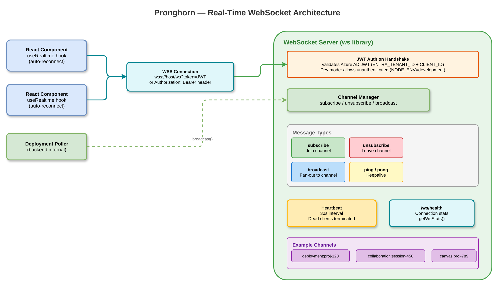

# Real-Time Communication

> Part of the [Pronghorn Architecture Documentation](../README.md)

---

## WebSocket Architecture

> 📊 Diagram: [`diagrams/blueprint-websocket-architecture.drawio`](./diagrams/blueprint-websocket-architecture.drawio)



## Connection Details

- **Endpoint:** `/ws` on the same HTTP server
- **Health check:** `/ws/health` returns connection stats
- **Auth:** JWT token from query `?token=` or `Authorization: Bearer` header
- **Dev mode:** Unauthenticated connections allowed when `NODE_ENV=development` or `SKIP_AUTH=true`
- **Heartbeat:** 30-second ping interval; dead clients terminated automatically

## Channel Pub/Sub

Clients subscribe to named channels and receive broadcast events:

```typescript
// Message types
type WSMessage = 'subscribe' | 'unsubscribe' | 'broadcast' | 'ping' | 'pong';

// Broadcasts fan out to all channel subscribers, optionally excluding sender
broadcast(channel: string, data: object, excludeSender?: WebSocket);
```

The deployment poller uses WebSocket broadcasts to push real-time deployment status updates to subscribed clients.
