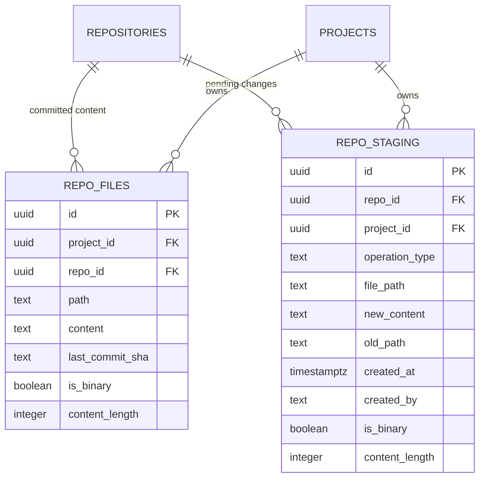

# Data Model: Staging Storage Optimization (Phase 1)

**Date**: 2026-05-19 | **Spec**: [spec.md](spec.md) | **Plan**: [plan.md](plan.md)

## Existing Schema (Unchanged)

### `repo_files` — Committed file content

```sql
-- Source: infra/migrations/001_full_schema.sql L874
CREATE TABLE IF NOT EXISTS repo_files (
  id           uuid DEFAULT gen_random_uuid() PRIMARY KEY,
  project_id   uuid REFERENCES projects(id) ON DELETE CASCADE,
  repo_id      uuid REFERENCES repositories(id) ON DELETE CASCADE,
  path         text NOT NULL,
  content      text,
  last_commit_sha text,
  is_binary    boolean DEFAULT false,
  content_length integer,
  UNIQUE(repo_id, path)
);
```

**Phase 1 impact**: No changes. This table becomes the source-of-truth for diff baselines (replacing `repo_staging.old_content`).

### `repo_staging` — Staged file changes

```sql
-- Source: infra/migrations/001_full_schema.sql L899
CREATE TABLE IF NOT EXISTS repo_staging (
  id             uuid DEFAULT gen_random_uuid() PRIMARY KEY,
  repo_id        uuid NOT NULL,
  project_id     uuid,
  operation_type text NOT NULL,    -- 'add', 'modify', 'delete', 'rename'
  file_path      text NOT NULL,
  old_content    text,             -- Phase 1: written as NULL; Phase 1b: column dropped
  new_content    text,
  old_path       text,
  created_at     timestamptz DEFAULT NOW(),
  created_by     text,
  is_binary      boolean DEFAULT false,
  content_length integer,
  UNIQUE(repo_id, file_path)
);
```

**Phase 1a changes (code only)**:
- `old_content` is always written as `NULL` — no schema change
- All existing rows with `old_content` populated remain valid and functional

**Phase 1b changes (after validation period)**:

```sql
-- infra/migrations/005_drop_old_content.sql
ALTER TABLE repo_staging DROP COLUMN IF EXISTS old_content;
```

## Schema Diff Summary

| Table          | Column        | Phase 1a                         | Phase 1b       |
| -------------- | ------------- | -------------------------------- | -------------- |
| `repo_staging` | `old_content` | Always `NULL` (code change only) | Column dropped |
| `repo_files`   | (all)         | No changes                       | No changes     |

## New RPC Endpoints

### `get_file_content_by_path_with_token`

**Purpose**: Fetch committed file content by repo_id + file_path for diff baseline display.

```sql
SELECT content, is_binary, content_length
FROM repo_files
WHERE repo_id = $1 AND path = $2
```

**Parameters**: `p_repo_id: uuid`, `p_file_path: text`, `p_token: text | null`
**Returns**: `{ content: string | null, is_binary: boolean, content_length: number | null }` or `null` if file doesn't exist (new file case)

### `batch_stage_files_with_token`

**Purpose**: Stage multiple file changes in a single transaction (AI batch staging).

```sql
BEGIN;
  -- For each file in batch:
  INSERT INTO repo_staging (repo_id, project_id, file_path, operation_type, old_content, new_content, old_path, created_at)
  VALUES ($1, $2, $3, $4, NULL, $5, $6, NOW())
  ON CONFLICT (repo_id, file_path) DO UPDATE SET
    operation_type = EXCLUDED.operation_type,
    old_content = NULL,
    new_content = EXCLUDED.new_content,
    old_path = EXCLUDED.old_path,
    created_at = NOW();
COMMIT;
```

**Parameters**: `p_repo_id: uuid`, `p_project_id: uuid`, `p_token: text | null`, `p_files: Array<{ file_path, operation_type, new_content, old_path? }>`
**Returns**: `{ data: Array<staged_row>, error: null }` or `{ data: null, error: string }`

## Entity Relationships



## Data Flow Changes

### Before (Phase 0 — Current)

```
User edits file → saveFileAsync:
  1. SELECT * FROM repo_staging WHERE repo_id = $1  (ALL rows, with content)
  2. DELETE FROM repo_staging WHERE repo_id = $1 AND file_path = $2
  3. INSERT INTO repo_staging (..., old_content, new_content, ...)
  
User views diff → StagingPanel:
  1. old_content from step 1 above (already loaded)
```

### After (Phase 1)

```
User edits file → saveFileAsync:
  1. INSERT INTO repo_staging (..., old_content=NULL, new_content, ...)
     ON CONFLICT (repo_id, file_path) DO UPDATE
     
User views diff → StagingPanel:
  1. SELECT content FROM repo_files WHERE repo_id = $1 AND path = $2  (on-demand)
```

### AI Agent — Before

```
AI task executes N file operations:
  For each operation:
    INSERT INTO repo_staging (..., old_content=NULL, new_content, ...)
  → N individual DB writes + N WebSocket broadcasts
```

### AI Agent — After

```
AI task executes N file operations:
  In-memory: sessionFileRegistry.set(file_path, { content, operation })
  At task end:
    BEGIN;
      For each entry in sessionFileRegistry:
        INSERT INTO repo_staging (...) ON CONFLICT ... DO UPDATE
    COMMIT;
  → 1 transaction, 1 WebSocket broadcast
```
