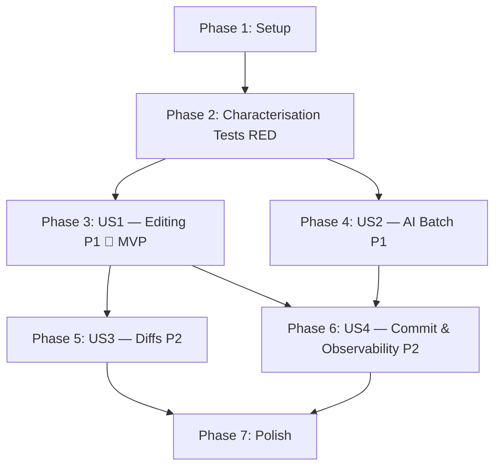

# Tasks: Staging Storage Optimization & Blob Migration

**Input**: Design documents from `/specs/003-staging-blob-storage/`
**Prerequisites**: plan.md (required), spec.md (required for user stories), research.md, data-model.md, contracts/

**Tests**: Every task in this feature follows TDD (RED → GREEN → REFACTOR → MEASURE). Characterisation tests are written first against the current implementation, then the optimisation is applied, then the same tests are re-run to verify improvement. Tests are included for all behaviour changes.

**Organization**: Tasks follow the TDD cycle per optimisation area, mapped to user stories. Phase 2 (US5 — Blob Storage Migration) is deferred.

## Format: `[ID] [P?] [Story] Description`

- **[P]**: Can run in parallel (different files, no dependencies)
- **[Story]**: Which user story this task belongs to (e.g., US1, US2, US3)
- Include exact file paths in descriptions

## Phase 1: Setup

**Purpose**: Project initialisation — test files and feature flag plumbing

- [X] T001 Create backend staging test file `app/backend/src/__tests__/utils/staging.test.ts` with mock setup (jest.mock database, logger, beforeEach reset)
- [X] T002 [P] Create frontend file buffer test file `app/frontend/src/hooks/__tests__/useFileBuffer.test.ts` with mock setup (vi.mock supabase, stageFile, renderHook imports)
- [X] T003 [P] Create frontend staging panel diff test file `app/frontend/src/components/__tests__/StagingPanel.diff.test.tsx` with mock setup
- [X] T004 [P] Create frontend CodeEditor save test file `app/frontend/src/components/__tests__/CodeEditor.save.test.tsx` with mock setup
- [X] T005 [P] Create backend AI batch staging test file `app/backend/src/__tests__/routes/aiBatchStaging.test.ts` with mock setup
- [X] T006 [P] Create backend observability test file `app/backend/src/__tests__/utils/stagingObservability.test.ts` with mock setup
- [X] T008 Add `STAGING_WRITE_OLD_CONTENT` feature flag support to `app/backend/src/utils/rpcHelpers.ts` (read from `process.env`, default `false`)

---

## Phase 2: Foundational — Characterisation Tests (RED)

**Purpose**: Write tests against the CURRENT implementation to document existing behaviour and capture baseline metrics. All tests MUST pass on the current codebase before any optimisation begins.

**⚠️ CRITICAL**: No optimisation work (Phase 3+) can begin until all characterisation tests pass on current code.

### Backend characterisation tests

- [X] T009 [US1] Write characterisation test: `stageFileChangeWithToken` stores `old_content` when provided — assert `mockQuery` receives non-null `$5` in `app/backend/src/__tests__/utils/staging.test.ts`
- [X] T010 [P] [US1] Write characterisation test: `stageFileChangeWithToken` stores `new_content` — assert `$6` matches provided content in `app/backend/src/__tests__/utils/staging.test.ts`
- [X] T011 [P] [US1] Write characterisation test: UPSERT handles re-stage of same file — assert `ON CONFLICT` SQL clause in `app/backend/src/__tests__/utils/staging.test.ts`
- [X] T012 [P] [US1] Write characterisation test: accepts null `old_content` for new files — assert `$5` = `null` in `app/backend/src/__tests__/utils/staging.test.ts`
- [X] T013 [P] [US1] Write characterisation test: returns the staged row from UPSERT — assert `RETURNING *` result in `app/backend/src/__tests__/utils/staging.test.ts`
- [X] T014 [P] [US3] Write characterisation test: `getStagedChangesWithToken` returns both `old_content` and `new_content` — assert both fields present in `app/backend/src/__tests__/utils/staging.test.ts`
- [X] T015 [P] [US1] Write baseline metric assertion: `stageFileChangeWithToken` executes exactly 1 `mockQuery` call per invocation in `app/backend/src/__tests__/utils/staging.test.ts`

### Frontend characterisation tests — Save path (useFileBuffer)

- [X] T016 [US1] Write characterisation test: `saveFileAsync` calls `get_staged_changes_with_token` before staging — spy confirms SELECT in `app/frontend/src/hooks/__tests__/useFileBuffer.test.ts`
- [X] T017 [P] [US1] Write characterisation test: `saveFileAsync` calls `unstage_file_with_token` when existing staged row found — spy confirms DELETE in `app/frontend/src/hooks/__tests__/useFileBuffer.test.ts`
- [X] T018 [P] [US1] Write characterisation test: `saveFileAsync` calls `stageFile` after unstage — assert `stageFile` called with `oldContent` from SELECT result in `app/frontend/src/hooks/__tests__/useFileBuffer.test.ts`
- [X] T019 [P] [US1] Write baseline metric assertion: total RPC calls per `saveFileAsync` = 3 (SELECT + DELETE + INSERT) in `app/frontend/src/hooks/__tests__/useFileBuffer.test.ts`
- [X] T020 [P] [US1] Write characterisation test: `saveFileAsync` preserves `old_content` from existing staged row in `app/frontend/src/hooks/__tests__/useFileBuffer.test.ts`
- [X] T021 [P] [US1] Write characterisation test: smart-unstage — reverted content triggers unstage in `app/frontend/src/hooks/__tests__/useFileBuffer.test.ts`
- [X] T022 [P] [US1] Write characterisation test: dirty detection based on `lastSavedContent` comparison in `app/frontend/src/hooks/__tests__/useFileBuffer.test.ts`

### Frontend characterisation tests — Save path (CodeEditor legacy)

- [X] T023 [US1] Write characterisation test: `handleSave` calls `get_staged_changes_with_token` before staging in `app/frontend/src/components/__tests__/CodeEditor.save.test.tsx`
- [X] T024 [P] [US1] Write characterisation test: `handleSave` total RPC calls per save = 3 in `app/frontend/src/components/__tests__/CodeEditor.save.test.tsx`

### Frontend characterisation tests — Diff viewer (StagingPanel)

- [X] T025 [US3] Write characterisation test: StagingPanel passes `old_content` from staged record as `diffOldContent` prop in `app/frontend/src/components/__tests__/StagingPanel.diff.test.tsx`
- [X] T026 [P] [US3] Write characterisation test: StagingPanel passes `new_content` from staged record as `initialContent` prop in `app/frontend/src/components/__tests__/StagingPanel.diff.test.tsx`
- [X] T027 [P] [US3] Write characterisation test: new file diff uses empty `old_content` baseline in `app/frontend/src/components/__tests__/StagingPanel.diff.test.tsx`

### Backend characterisation tests — AI staging

- [X] T028 [US2] Write characterisation test: `edit_lines` calls `stageFileChangeWithToken` individually — 5 edits → 5 calls in `app/backend/src/__tests__/routes/aiBatchStaging.test.ts`
- [X] T029 [P] [US2] Write characterisation test: `create_file` calls `stageFileChangeWithToken` individually — 3 creates → 3 calls in `app/backend/src/__tests__/routes/aiBatchStaging.test.ts`
- [X] T030 [P] [US2] Write characterisation test: each staging triggers WebSocket broadcast — N operations → N broadcasts in `app/backend/src/__tests__/routes/aiBatchStaging.test.ts`
- [X] T031 [P] [US2] Write baseline metric assertion: total DB operations = N for N file changes in `app/backend/src/__tests__/routes/aiBatchStaging.test.ts`

### Backend characterisation tests — Observability

- [X] T032 [US4] Write characterisation test: `stageFileChangeWithToken` does NOT log timing (`logger.info` not called with `stage_duration_ms`) in `app/backend/src/__tests__/utils/stagingObservability.test.ts`
- [X] T033 [P] [US4] Write characterisation test: `commitStagedWithToken` does NOT log timing (`logger.info` not called with `commit_duration_ms`) in `app/backend/src/__tests__/utils/stagingObservability.test.ts`

### Validate all characterisation tests pass

- [X] T034 Run `cd app/backend && npm test -- --testPathPatterns "staging|aiBatch|stagingObservability"` — all characterisation tests MUST pass on current code
- [X] T035 [P] Run `cd app/frontend && npm test -- src/hooks/__tests__/useFileBuffer.test.ts src/components/__tests__/StagingPanel.diff.test.tsx src/components/__tests__/CodeEditor.save.test.tsx` — all characterisation tests MUST pass on current code

**Checkpoint**: All characterisation tests pass on current code. Baseline metrics documented: 3 RPC calls per save, N DB ops per AI task, zero observability logging. Implementation can now begin.

---

## Phase 3: User Story 1 — User Editing Code Files (Priority: P1) 🎯 MVP

**Goal**: Reduce per-save database operations from 3 to 1, eliminate redundant `old_content` storage

**Independent Test**: Edit 5+ files, save, switch between them rapidly — verify all changes preserved, single UPSERT per save, no SELECT/DELETE calls, save latency <500ms

### Optimisation 1.1 — Eliminate `old_content` from staging writes (REFACTOR)

- [X] T036 [US1] Modify `stageFileChangeWithToken` in `app/backend/src/utils/rpcHelpers.ts` to force `old_content` to `null` regardless of caller input (respect `STAGING_WRITE_OLD_CONTENT` feature flag)
- [X] T037 [US1] Modify `stage_file_change_with_token` RPC handler in `app/backend/src/routes/rpc.ts` to pass `null` for `p_old_content`
- [X] T038 [P] [US1] Modify AI agent operations (`edit_lines`, `create_file`, `delete_file`, `move_file`) in `app/backend/src/routes/functions.ts` to stop passing `old_content`

### Verify 1.1 — Re-run tests (MEASURE)

- [X] T039 [US1] Re-run `staging.test.ts` — update `stores old_content when provided` test: assert `$5` = `null` regardless of input in `app/backend/src/__tests__/utils/staging.test.ts`
- [X] T040 [P] [US1] Add optimised test: `old_content is null even when caller provides content` in `app/backend/src/__tests__/utils/staging.test.ts`
- [X] T041 [P] [US1] Add optimised test: `feature flag STAGING_WRITE_OLD_CONTENT=true re-enables old_content writes` in `app/backend/src/__tests__/utils/staging.test.ts`
- [X] T042 [US1] Run `cd app/backend && npm test -- --testPathPattern staging` and `npm run build` — all pass

### Optimisation 1.2 — Replace SELECT-DELETE-INSERT with single UPSERT (REFACTOR)

- [X] T043 [US1] Modify `saveFileAsync` in `app/frontend/src/hooks/useFileBuffer.ts` — remove `get_staged_changes_with_token` SELECT call, remove `unstage_file_with_token` DELETE call, call `stageFile` directly with `oldContent: null`
- [X] T044 [US1] Modify operation type derivation in `saveFileAsync` — derive from `file.isStaged` and `file.id` instead of SELECT result in `app/frontend/src/hooks/useFileBuffer.ts`
- [X] T045 [P] [US1] Modify `handleSave` in `app/frontend/src/components/repository/CodeEditor.tsx` — same transformation: remove SELECT + DELETE, single UPSERT with `old_content: null`
- [X] T046 [P] [US1] Update `stageFile` in `app/frontend/src/lib/stagingOperations.ts` — stop sending `old_content` parameter

### Verify 1.2 — Re-run tests (MEASURE)

- [X] T047 [US1] Re-run `useFileBuffer.test.ts` — update characterisation tests: assert `get_staged_changes_with_token` NOT called, `unstage_file_with_token` NOT called, total RPC calls = 1 in `app/frontend/src/hooks/__tests__/useFileBuffer.test.ts`
- [X] T048 [P] [US1] Add optimised test: `single RPC call per save` — assert `stageFile` called exactly once in `app/frontend/src/hooks/__tests__/useFileBuffer.test.ts`
- [X] T049 [P] [US1] Add optimised test: `operation type derived from buffer state` — assert `file.isStaged && file.id` → `"modify"`, `!file.id` → `"add"` in `app/frontend/src/hooks/__tests__/useFileBuffer.test.ts`
- [X] T050 [P] [US1] Add optimised test: `oldContent is always null` in `app/frontend/src/hooks/__tests__/useFileBuffer.test.ts`
- [X] T051 [US1] Re-run `CodeEditor.save.test.tsx` — update: assert total RPC = 1, no SELECT in `app/frontend/src/components/__tests__/CodeEditor.save.test.tsx`
- [X] T052 [US1] Confirm unchanged tests still pass: `smart-unstage` and `dirty detection` in `app/frontend/src/hooks/__tests__/useFileBuffer.test.ts`
- [X] T053 [US1] Run `cd app/frontend && npm run lint && npm run build` — lint and build succeed

**Checkpoint**: User Story 1 complete. Save operations reduced from 3 DB ops to 1 UPSERT. `old_content` no longer stored. Measurable: RPC spy count 3 → 1.

---

## Phase 4: User Story 2 — AI/LLM Agent Batch Staging (Priority: P1)

**Goal**: Reduce AI agent staging from N individual DB writes to 1 transaction

**Independent Test**: Trigger AI task editing 20 files — verify single transaction, single WebSocket broadcast, <2s completion

**Note**: Batch approach is a proposal; final design requires team review per OQ-001.

### Optimisation — Batch staging via `sessionFileRegistry` flush (REFACTOR)

- [X] T054 [US2] Create `batchStageFiles` function in `app/backend/src/utils/rpcHelpers.ts` — accepts array of files, wraps in `BEGIN`/`COMMIT` transaction with individual UPSERTs, `ROLLBACK` on any failure
- [X] T055 [US2] Add `batch_stage_files_with_token` RPC handler in `app/backend/src/routes/rpc.ts` — validate input array (reject >100 files with 400 error), call `batchStageFiles`, single `staging_refresh` WebSocket broadcast
- [X] T056 [US2] Modify AI agent file operations in `app/backend/src/routes/functions.ts` — `edit_lines`, `create_file`, `delete_file`, `move_file` update `sessionFileRegistry` only; call `batchStageFiles` at task end
- [X] T057 [US2] Add fallback in `app/backend/src/routes/functions.ts` — if `batchStageFiles` fails, fall back to individual `stageFileChangeWithToken` calls and log warning

### Verify — Re-run tests (MEASURE)

- [X] T058 [US2] Re-run `aiBatchStaging.test.ts` — update characterisation tests: individual `stageFileChangeWithToken` calls no longer happen during task, single broadcast after batch in `app/backend/src/__tests__/routes/aiBatchStaging.test.ts`
- [X] T059 [P] [US2] Add optimised test: `batchStageFiles writes N files in single transaction` — assert `mockQuery` called with `BEGIN`, N UPSERTs, `COMMIT` in `app/backend/src/__tests__/routes/aiBatchStaging.test.ts`
- [X] T060 [P] [US2] Add optimised test: `partial failure rolls back all files` — assert `ROLLBACK` on error in `app/backend/src/__tests__/routes/aiBatchStaging.test.ts`
- [X] T061 [P] [US2] Add optimised test: `single WebSocket broadcast after batch` — assert `ws.broadcast` called exactly 1 time in `app/backend/src/__tests__/routes/aiBatchStaging.test.ts`
- [X] T062 [P] [US2] Add optimised test: `fallback to individual staging on batch failure` — assert individual calls fire after `ROLLBACK` in `app/backend/src/__tests__/routes/aiBatchStaging.test.ts`
- [X] T062a [P] [US2] Add validation test: `batch_stage_files_with_token rejects >100 files` — assert 400 error with descriptive message in `app/backend/src/__tests__/routes/aiBatchStaging.test.ts`
- [X] T063 [US2] Run `cd app/backend && npm test -- --testPathPatterns aiBatch` and `npm run build` — all pass

**Checkpoint**: User Story 2 complete. AI agent DB operations reduced from N → 1 transaction. WebSocket broadcasts from N → 1. Measurable: mockQuery call count N → BEGIN + N UPSERTs + COMMIT in single transaction.

---

## Phase 5: User Story 3 — Reviewing Staged Changes with Diffs (Priority: P2)

**Goal**: Diff viewer fetches committed baseline on-demand from `repo_files` instead of relying on `old_content` in `repo_staging`

**Independent Test**: Stage 3 files (new, modified, deleted), view diffs for each — verify correct baselines, <1s load time

### Backend — New RPC for diff baseline

- [X] T064 [US3] Add `get_file_content_by_path_with_token` RPC handler in `app/backend/src/routes/rpc.ts` — `SELECT content, is_binary, content_length FROM repo_files WHERE repo_id = $1 AND path = $2`
- [X] T065 [P] [US3] Add `getFileContentByPathWithToken` helper in `app/backend/src/utils/rpcHelpers.ts` — accepts `repoId`, `filePath`, returns `{ content, is_binary, content_length }` or `null`

### Frontend — On-demand baseline fetch

- [X] T066 [US3] Modify StagingPanel diff viewer in `app/frontend/src/components/build/StagingPanel.tsx` — when user clicks to view diff: `add` → baseline = `""`, `modify`/`edit` → fetch baseline from `get_file_content_by_path_with_token`, `delete` → fetch committed content as baseline with `new_content = ""`

### Verify — Re-run tests (MEASURE)

- [X] T067 [US3] Re-run `StagingPanel.diff.test.tsx` — update: assert baseline fetched from `get_file_content_by_path_with_token` RPC instead of `old_content` in `app/frontend/src/components/__tests__/StagingPanel.diff.test.tsx`
- [X] T068 [P] [US3] Add optimised test: `modify` — fetches baseline from `get_file_content_by_path_with_token` with correct `repo_id` + `file_path` in `app/frontend/src/components/__tests__/StagingPanel.diff.test.tsx`
- [X] T069 [P] [US3] Add optimised test: `delete` — fetches full committed content as baseline in `app/frontend/src/components/__tests__/StagingPanel.diff.test.tsx`
- [X] T070 [P] [US3] Add optimised test: `add` — uses empty baseline without RPC call in `app/frontend/src/components/__tests__/StagingPanel.diff.test.tsx`
- [X] T071 [P] [US3] Add optimised test: baseline fetch is on-demand (not on panel load) in `app/frontend/src/components/__tests__/StagingPanel.diff.test.tsx`
- [X] T072 [P] [US3] Add backend test: `get_file_content_by_path_with_token` returns content for existing file in `app/backend/src/__tests__/utils/staging.test.ts`
- [X] T073 [P] [US3] Add backend test: `get_file_content_by_path_with_token` returns null for non-existent path (new file) in `app/backend/src/__tests__/utils/staging.test.ts`
- [X] T074 [US3] Confirm unchanged test still passes: `new_content` passed as `initialContent` in `app/frontend/src/components/__tests__/StagingPanel.diff.test.tsx`
- [X] T075 [US3] Run `cd app/frontend && npm run lint && npm run build` and `cd app/backend && npm run build` — all pass

**Checkpoint**: User Story 3 complete. Diff viewer no longer depends on `old_content`. Baselines fetched on-demand from `repo_files`.

---

## Phase 6: User Story 4 — Commit, Push & Observability (Priority: P2)

**Goal**: Add observability instrumentation for stage/commit timing. Commit flow is unmodified but verified against new staging patterns.

**Independent Test**: Stage 5 files, commit, push — verify success + structured logs emitted with `stage_duration_ms`, `commit_duration_ms`, `commit_files_count`

### Observability instrumentation (REFACTOR)

- [X] T076 [US4] Add stage operation timing to `stageFileChangeWithToken` in `app/backend/src/utils/rpcHelpers.ts` — `logger.info({ event: "stage_complete", stage_duration_ms, file_path, operation_type })`
- [X] T077 [P] [US4] Add batch stage timing to `batchStageFiles` in `app/backend/src/utils/rpcHelpers.ts` — `logger.info({ event: "batch_stage_complete", stage_duration_ms, staged_count })`
- [X] T078 [P] [US4] Add commit timing to `commit_staged_with_token` handler in `app/backend/src/routes/rpc.ts` — `logger.info({ event: "commit_complete", commit_duration_ms, commit_files_count, success })`
- [X] T078a [P] [OR-002] Add staging row count logging to `stageFileChangeWithToken` and `batchStageFiles` in `app/backend/src/utils/rpcHelpers.ts` — after UPSERT/batch, query `SELECT count(*) FROM repo_staging WHERE repo_id = $1` and include `staging_row_count` in the structured log

### Verify — Re-run tests (MEASURE)

- [X] T079 [US4] Re-run `stagingObservability.test.ts` — update: assert `logger.info` IS called with `stage_duration_ms` in `app/backend/src/__tests__/utils/stagingObservability.test.ts`
- [X] T080 [P] [US4] Update: assert `logger.info` IS called with `commit_duration_ms` and `commit_files_count` in `app/backend/src/__tests__/utils/stagingObservability.test.ts`
- [X] T081 [P] [US4] Add test: `stage logs include duration_ms and file_path` — assert `logger.info` called with matching object in `app/backend/src/__tests__/utils/stagingObservability.test.ts`
- [X] T082 [P] [US4] Add test: `batch stage logs include staged_count` in `app/backend/src/__tests__/utils/stagingObservability.test.ts`
- [X] T082a [P] [OR-002] Add test: `stage logs include staging_row_count for affected repo` — assert `logger.info` called with `staging_row_count: expect.any(Number)` in `app/backend/src/__tests__/utils/stagingObservability.test.ts`
- [X] T083 [US4] Run `cd app/backend && npm test -- --testPathPattern stagingObservability` and `npm run build` — all pass

### Commit flow regression verification

- [X] T084 [US4] Add regression test: `commitStagedWithToken` works correctly with null `old_content` rows — staged content moves to `repo_files`, staging cleared in `app/backend/src/__tests__/utils/staging.test.ts`
- [X] T085 [P] [US4] Add regression test: `commitStagedWithToken` rollback on failure preserves staging in `app/backend/src/__tests__/utils/staging.test.ts`

**Checkpoint**: User Story 4 complete. Commit/push flow verified against optimised staging. Observability logging in place.

---

## Phase 7: Polish & Cross-Cutting Concerns

**Purpose**: Migration prep, documentation, final validation

- [ ] T104 [P] Create deferred migration file `infra/migrations/006_drop_old_content.sql` — `ALTER TABLE repo_staging DROP COLUMN IF EXISTS old_content` with rollback comment
- [ ] T105 [P] Update `specs/003-staging-blob-storage/quickstart.md` with final verification steps and implementation summary
- [ ] T106 Run full backend test suite: `cd app/backend && npm test` — all suites pass (staging + existing)
- [ ] T107 [P] Run full frontend test suite: `cd app/frontend && npm test` — all suites pass (staging + existing)
- [ ] T108 Run full builds: `cd app/backend && npm run build` and `cd app/frontend && npm run lint && npm run build`
- [ ] T109 [P] Update `docs/UNIT_TESTS.md` — add staging test suites to the test suite catalog
- [ ] T111 Run `quickstart.md` verification steps end-to-end against local Docker Compose stack

**Checkpoint**: All code changes validated and documentation refreshed.

---

## Dependencies & Execution Order

### Phase Dependencies

- **Setup (Phase 1)**: No dependencies — can start immediately
- **Characterisation Tests (Phase 2)**: Depends on Phase 1 (test files exist). BLOCKS all optimisations
- **US1 Editing (Phase 3)**: Depends on Phase 2 (characterisation tests pass). MVP — implement first
- **US2 AI Batch (Phase 4)**: Depends on Phase 2. Can run in parallel with Phase 3 (different files)
- **US3 Diffs (Phase 5)**: Depends on Phase 3 (old_content eliminated, need baseline from repo_files)
- **US4 Commit & Observability (Phase 6)**: Depends on Phase 3 + Phase 4 (optimised code to instrument)
- **Polish (Phase 7)**: Depends on all user story phases complete

### User Story Dependencies

- **US1 (Editing)** + **US2 (AI Batch)**: Can start in parallel after Phase 2. Both target different files (frontend hooks vs backend functions.ts)
- **US3 (Diffs)**: Depends on US1 — needs `old_content` elimination complete to add baseline fetch
- **US4 (Commit & Observability)**: Depends on US1 + US2 — instruments the optimised code paths
- **US5 (Blob Migration)**: Deferred — Phase 2 planning trigger after load test results

### Within Each User Story (TDD Cycle)

1. Characterisation tests already pass (from Phase 2)
2. REFACTOR: Apply optimisation change
3. MEASURE: Re-run tests — update intentionally-failing tests, add optimised assertions
4. Build verification: `npm run build` / `npm run lint`

### Parallel Opportunities

- T002–T007 (Setup): All [P] test file creation can run in parallel
- T009–T033 (Phase 2): Most characterisation tests within each layer can run in parallel
- Phase 3 + Phase 4: Can run in parallel (different source files)
- T106–T107: Backend + frontend full test suites in parallel

### Implementation Strategy

1. **MVP**: Phase 1 + Phase 2 + Phase 3 (US1 editing) — delivers the highest-value optimisation (3→1 DB ops per save)
2. **Incremental**: Phase 4 (US2 AI batch) — next-highest value, targets AI burst load
3. **Complete**: Phase 5 + 6 + 7 — diff viewer, observability, polish
