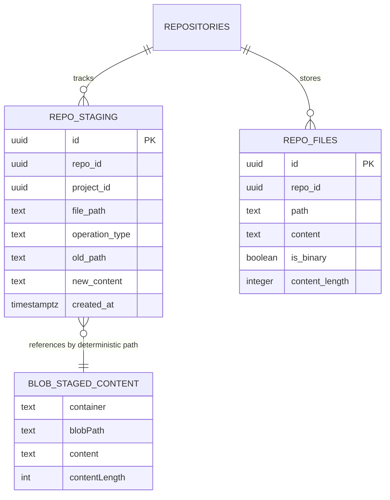

# Data Model: Staging Content Blob Storage

**Date**: 2026-05-22 | **Spec**: [spec.md](spec.md) | **Plan**: [plan.md](plan.md)

## Entity Overview

## 1) Staged File Content (Blob)

Purpose: Store staged text content outside PostgreSQL.

Key fields:
- `container`: `staging`
- `blobPath`: `staging/{repoId}/{filePath}`
- `content`: UTF-8 text payload
- `contentLength`: byte length of payload
- `lastModified`: blob storage timestamp metadata

Validation rules:
- Required for `operation_type in ('create', 'modify', 'rename')`
- Not written for `operation_type = 'delete'`
- Re-stage of same file overwrites existing blob

Lifecycle:
- Created/overwritten on stage write
- Read on commit for non-delete operations
- Deleted on successful commit/discard cleanup paths

## 2) Staging Metadata (PostgreSQL `repo_staging` row)

Purpose: Track staged operation intent and routing metadata.

Relevant fields:
- `repo_id` (required)
- `project_id` (nullable)
- `file_path` (required)
- `operation_type` (`create|modify|delete|rename` semantics)
- `old_path` (used for rename)
- `new_content` (set to `NULL` for this feature)
- `created_at`

Validation rules:
- `UNIQUE(repo_id, file_path)` UPSERT semantics remain
- `new_content` must remain `NULL` for blob-backed writes
- Delete operations must not require blob content

Lifecycle:
- UPSERTed on stage save/batch stage
- Consumed at commit/discard
- Removed on commit/discard clear

## 3) Committed Content (PostgreSQL `repo_files` row)

Purpose: Durable committed repository content.

Relevant fields:
- `repo_id`
- `path`
- `content`
- `content_length`
- `is_binary`

Validation rules:
- Non-delete staged files commit by copying blob content into `repo_files.content`
- Delete staged files commit by removing target row

Lifecycle:
- Updated/inserted/deleted within commit transaction
- Continues as source of truth for downstream GitHub push flow

## Relationship and Flow

## State Transitions

1. Stage (single): write blob -> UPSERT `repo_staging` metadata with `new_content = NULL`.
2. Stage (batch): parallel blob writes for non-delete files -> single transaction metadata UPSERTs.
3. Commit: transaction reads staged rows -> reads blobs for non-delete rows -> writes `repo_files` -> clears staged rows -> post-commit blob cleanup for committed subset.
4. Discard single: delete staged row + delete matching blob.
5. Discard all: delete all staged rows for repo + delete blob prefix `staging/{repoId}/`.

## Failure Model

- Blob write failure: abort staging operation, do not write metadata row.
- DB UPSERT failure after blob write: fail operation; orphan blob may remain (accepted in scope).
- Missing blob on commit for non-delete row: throw error, roll back commit transaction, preserve staging rows.
- Blob cleanup failure after successful commit/discard row removal: do not roll back DB changes; log orphan cleanup error.
